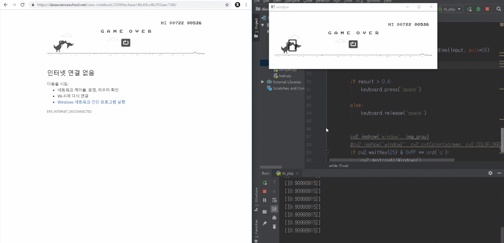

# Requirements

Python 3.5, CUDA 9.0, cudnn 7.3.1 and other common packages listed in `requirements.txt`.


# Installation
### 1. Clone this repository

### 2. Install dependencies 
``` pip install -r requirements.txt```


# Sample test
### 1. templet.py
- Check templet maching **cactus** and **buird** image.

### 2. make_data.py
- Make training data with keyboard input.
- After generate **.txt** file, please convert the extension name to **.csv**.
- **dino.csv**

### 3. train.py
- Train data with tensorflow.
- **dino.h5**

### 4. AI_play.py
- Load model and automatic play.


